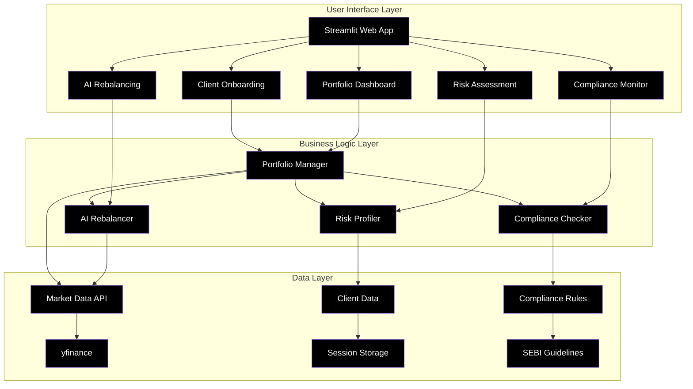
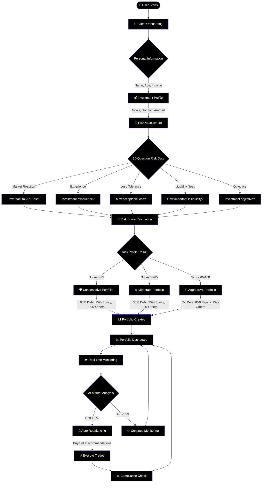
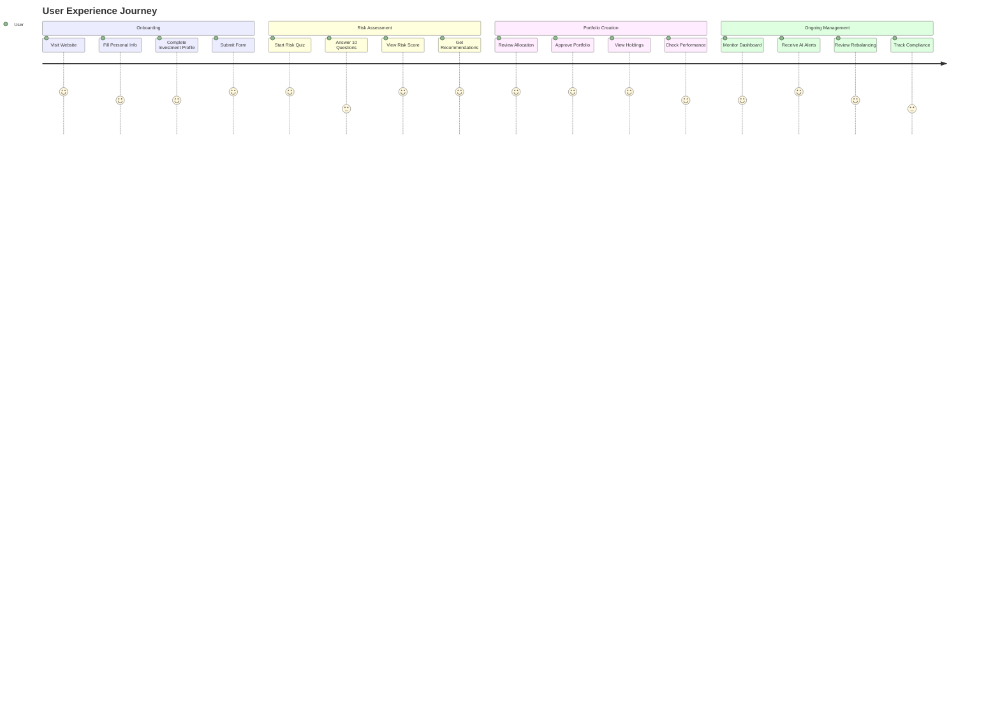
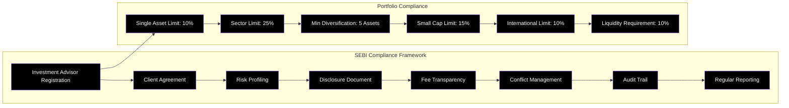
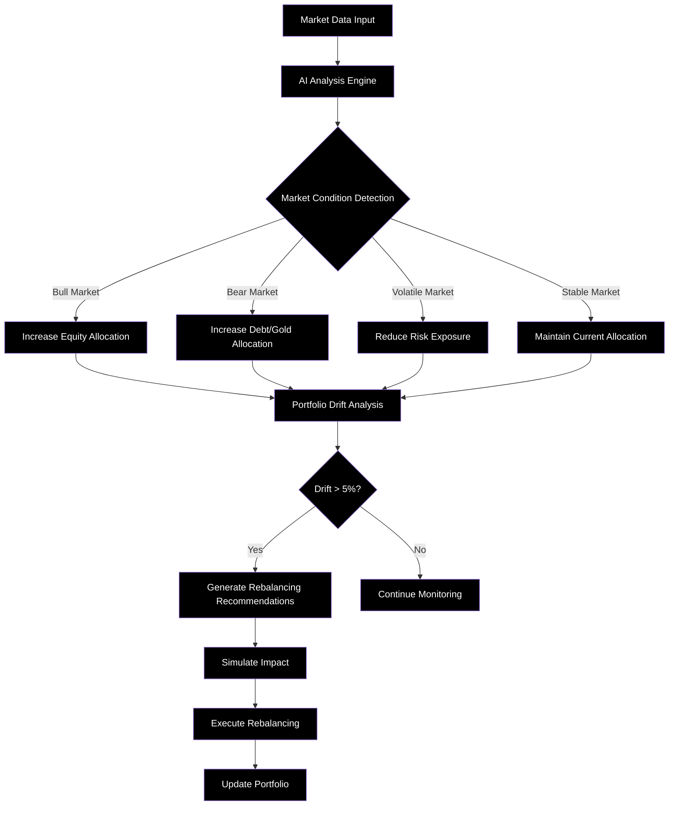

# 🤖 RoboAdvisor Pro - AI-Powered Investment Platform

> **A SEBI-compliant robo-advisory system that creates personalized investment portfolios using AI and machine learning**

[](https://streamlit.io/)
[](https://python.org/)
[](LICENSE)

## 📋 Table of Contents
- [🎯 What is RoboAdvisor Pro?](#-what-is-roboadvisor-pro)
- [🏗️ System Architecture](#️-system-architecture)
- [🚀 Quick Start Guide](#-quick-start-guide)
- [📊 How It Works](#-how-it-works)
- [🔧 Installation](#-installation)
- [💼 User Journey](#-user-journey)
- [🏛️ SEBI Compliance](#️-sebi-compliance)
- [🧠 AI Features](#-ai-features)
- [📈 Portfolio Types](#-portfolio-types)
- [🔍 Technical Details](#-technical-details)
- [🤝 Contributing](#-contributing)

## 🎯 What is RoboAdvisor Pro?

RoboAdvisor Pro is an intelligent investment advisory platform that:
- **Creates personalized portfolios** based on your risk profile and financial goals
- **Uses AI algorithms** to automatically rebalance your investments
- **Ensures SEBI compliance** for all investment recommendations
- **Provides real-time monitoring** of your portfolio performance

### 🌟 Key Benefits
- ✅ **Automated Portfolio Management** - No manual intervention needed
- ✅ **SEBI Compliant** - Follows all regulatory guidelines
- ✅ **AI-Powered Decisions** - Smart rebalancing based on market conditions
- ✅ **Risk-Based Allocation** - Tailored to your risk appetite
- ✅ **Real-time Monitoring** - Track performance 24/7

## 🏗️ System Architecture



## 🚀 Quick Start Guide

### Prerequisites
- Python 3.8 or higher
- Internet connection for market data
- Basic understanding of investments (helpful but not required)

### 1-Minute Setup
```bash
# Clone the repository
git clone https://github.com/your-username/roboadvisor-pro.git
cd roboadvisor-pro

# Install dependencies
pip install -r requirements.txt

# Run the application
streamlit run app.py
```

🎉 **That's it!** Your RoboAdvisor Pro will be running at `http://localhost:8501`

## 📊 How It Works

### Complete User Flow Diagram



## 🔧 Installation

### Method 1: Standard Installation
```bash
# 1. Clone the repository
git clone https://github.com/your-username/roboadvisor-pro.git
cd roboadvisor-pro

# 2. Create virtual environment (recommended)
python -m venv roboadvisor_env
source roboadvisor_env/bin/activate  # On Windows: roboadvisor_env\Scripts\activate

# 3. Install dependencies
pip install -r requirements.txt

# 4. Run the application
streamlit run app.py
```

### Method 2: Docker Installation (Coming Soon)
```bash
# Pull and run Docker container
docker pull roboadvisor/pro:latest
docker run -p 8501:8501 roboadvisor/pro:latest
```

### Dependencies Explained
```
streamlit>=1.28.0     # Web framework for the UI
pandas>=2.0.0         # Data manipulation and analysis
numpy>=1.25.0         # Numerical computing
plotly>=5.17.0        # Interactive charts and graphs
yfinance>=0.2.18      # Market data from Yahoo Finance
scikit-learn>=1.3.0   # Machine learning algorithms
requests>=2.31.0      # HTTP requests for APIs
python-dotenv>=1.0.0  # Environment variable management
```

## 💼 User Journey

### Step-by-Step Process



### 1. 📝 Client Onboarding (5 minutes)
**What you'll provide:**
- Personal details (Name, Age, Income)
- Investment amount and goals
- Time horizon for investments
- Employment and financial situation

**What happens:**
- System validates your information
- Creates your investor profile
- Prepares for risk assessment

### 2. 🎯 Risk Assessment (10 minutes)
**The 10-Question Quiz covers:**
1. **Market Reaction**: How you'd respond to portfolio losses
2. **Experience Level**: Your investment knowledge
3. **Loss Tolerance**: Maximum acceptable annual loss
4. **Liquidity Needs**: How quickly you need access to funds
5. **Investment Objective**: Growth vs. preservation goals
6. **Volatility Response**: Reaction to short-term fluctuations
7. **Time Horizon**: Investment duration preferences
8. **Financial Situation**: Current financial stability
9. **Decision Style**: Conservative to aggressive approach
10. **Wealth Allocation**: Percentage of total wealth investing

**Risk Score Calculation:**
```
Total Score = Σ(Question Scores) / Maximum Possible Score × 100

Risk Categories:
• 0-35: Conservative (Low Risk)
• 36-65: Moderate (Medium Risk)  
• 66-100: Aggressive (High Risk)
```

### 3. 📊 Portfolio Creation (Instant)
Based on your risk profile, the AI creates a diversified portfolio:

**Conservative Portfolio (Low Risk)**
```
🛡️ Asset Allocation:
├── 60% Debt Funds (Stability)
├── 25% Large Cap Equity (Growth)
├── 10% Gold ETF (Hedge)
└── 5% International Funds (Diversification)

Expected Return: 8-10% annually
Risk Level: 3/10
```

**Moderate Portfolio (Medium Risk)**
```
⚖️ Asset Allocation:
├── 35% Debt Funds (Stability)
├── 35% Large Cap Equity (Growth)
├── 15% Mid Cap Equity (Higher Growth)
├── 10% Gold ETF (Hedge)
└── 5% International Funds (Diversification)

Expected Return: 10-12% annually
Risk Level: 6/10
```

**Aggressive Portfolio (High Risk)**
```
🚀 Asset Allocation:
├── 50% Large Cap Equity (Growth)
├── 25% Mid Cap Equity (Higher Growth)
├── 15% Small Cap Equity (Maximum Growth)
├── 5% Debt Funds (Minimal Stability)
├── 3% Gold ETF (Small Hedge)
└── 2% International Funds (Global Exposure)

Expected Return: 12-15% annually
Risk Level: 8.5/10
```

## 🏛️ SEBI Compliance

### Regulatory Framework



### Compliance Checklist
- ✅ **Registration**: Valid SEBI Investment Advisor license
- ✅ **Documentation**: Client agreements and disclosures
- ✅ **Risk Assessment**: Mandatory profiling per SEBI guidelines
- ✅ **Transparency**: Clear fee structure and conflict disclosure
- ✅ **Monitoring**: Continuous compliance checking
- ✅ **Reporting**: Regular audit trails and reports

## 🧠 AI Features

### Intelligent Rebalancing System



### AI Decision Factors
1. **Market Volatility**: VIX levels and market sentiment
2. **Momentum Indicators**: Price trends and moving averages
3. **Correlation Analysis**: Asset class relationships
4. **Economic Indicators**: GDP, inflation, interest rates
5. **Sector Performance**: Relative strength analysis

## 📈 Portfolio Types

### Detailed Asset Allocation

| Risk Level | Large Cap | Mid Cap | Small Cap | Debt | Gold | International |
|------------|-----------|---------|-----------|------|------|---------------|
| **Conservative** | 25% | 5% | 0% | 60% | 10% | 0% |
| **Moderate** | 35% | 15% | 5% | 35% | 5% | 5% |
| **Aggressive** | 50% | 25% | 15% | 5% | 3% | 2% |

### Sample Fund Recommendations

**Large Cap Equity Funds:**
- HDFC Top 100 Fund
- ICICI Pru Bluechip Fund
- SBI Large Cap Fund

**Mid Cap Equity Funds:**
- HDFC Mid-Cap Opportunities Fund
- Axis Midcap Fund
- Kotak Emerging Equity

**Debt Funds:**
- HDFC Corporate Bond Fund
- ICICI Pru Corporate Bond
- Axis Corporate Debt Fund

## 🔍 Technical Details

### Project Structure
```
roboadvisor-pro/
├── 📄 app.py                    # Main Streamlit application
├── 📄 portfolio_manager.py      # Portfolio creation & management
├── 📄 risk_profiler.py         # Risk assessment algorithms
├── 📄 compliance_checker.py    # SEBI compliance monitoring
├── 📄 rebalancer.py            # AI rebalancing engine
├── 📄 requirements.txt         # Python dependencies
└── 📄 README.md               # This documentation
```

### Core Classes and Methods

#### PortfolioManager
```python
class PortfolioManager:
    def create_portfolio(client_data) -> dict
    def calculate_portfolio_metrics(portfolio) -> dict
    def rebalance_portfolio(portfolio, target_allocation) -> list
    def get_performance_data(portfolio) -> dict
```

#### RiskProfiler
```python
class RiskProfiler:
    def calculate_risk_score(answers) -> dict
    def assess_risk_capacity(client_data) -> dict
    def get_risk_adjusted_allocation(risk_profile, risk_capacity) -> dict
```

#### AIRebalancer
```python
class AIRebalancer:
    def get_rebalancing_recommendations(portfolio) -> list
    def analyze_market_conditions() -> dict
    def calculate_optimal_allocation(portfolio, risk_tolerance, market_outlook) -> dict
    def simulate_rebalancing_impact(portfolio, proposed_allocation) -> dict
```

### Technology Stack Deep Dive

| Component | Technology | Purpose |
|-----------|------------|---------|
| **Frontend** | Streamlit | Interactive web interface |
| **Data Processing** | Pandas, NumPy | Data manipulation and calculations |
| **Visualization** | Plotly | Interactive charts and graphs |
| **Market Data** | yfinance | Real-time market data |
| **AI/ML** | scikit-learn | Risk profiling and rebalancing algorithms |
| **API Requests** | requests | External data fetching |
| **Environment** | python-dotenv | Configuration management |

## 🤝 Contributing

We welcome contributions! Here's how you can help:

### Development Setup
```bash
# Fork the repository
git clone https://github.com/your-username/roboadvisor-pro.git
cd roboadvisor-pro

# Create a feature branch
git checkout -b feature/your-feature-name

# Make your changes and test
python -m pytest tests/

# Submit a pull request
git push origin feature/your-feature-name
```

### Areas for Contribution
- 🐛 **Bug Fixes**: Report and fix issues
- ✨ **New Features**: Add new functionality
- 📚 **Documentation**: Improve guides and examples
- 🧪 **Testing**: Add test cases
- 🎨 **UI/UX**: Enhance user interface
- 🔒 **Security**: Improve security measures

## 📞 Support & Contact

### Getting Help
- 📖 **Documentation**: Check this README first
- 🐛 **Issues**: [GitHub Issues](https://github.com/your-username/roboadvisor-pro/issues)
- 💬 **Discussions**: [GitHub Discussions](https://github.com/your-username/roboadvisor-pro/discussions)
- 📧 **Email**: support@roboadvisor-pro.com

### Compliance Support
For SEBI compliance queries:
- 📞 **Phone**: +91-XXXX-XXXXXX
- 📧 **Email**: compliance@roboadvisor-pro.com
- 🌐 **Website**: [www.roboadvisor-pro.com](https://www.roboadvisor-pro.com)

## ⚖️ Legal Disclaimer

> **Important**: This is a demonstration application for educational purposes. Before using for actual investment advisory services, ensure:
> 
> 1. ✅ Proper SEBI Investment Advisor registration
> 2. ✅ Valid professional indemnity insurance
> 3. ✅ Compliance with all applicable regulations
> 4. ✅ Regular legal and compliance reviews
> 5. ✅ Client agreement execution

## 📄 License

This project is licensed under the MIT License - see the [LICENSE](LICENSE) file for details.

---

<div align="center">

**Made with ❤️ for the Indian Investment Community**

[⭐ Star this repo](https://github.com/your-username/roboadvisor-pro) | [🐛 Report Bug](https://github.com/your-username/roboadvisor-pro/issues) | [💡 Request Feature](https://github.com/your-username/roboadvisor-pro/issues)

</div>