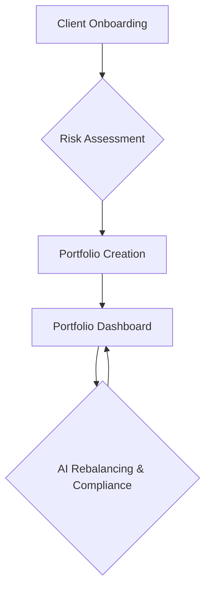

# RoboAdvisor Pro

Welcome to RoboAdvisor Pro! This is a beginner-friendly guide to help you understand what this project is all about.

## What is RoboAdvisor Pro?

RoboAdvisor Pro is a smart investment assistant that helps you manage your money. It's like having a financial expert in your computer! The goal of this project is to make investing simple, transparent, and compliant with regulations.

## How does it work?

The project follows a simple workflow to help you on your investment journey. Here's a diagram that shows the process:

### 1. Client Onboarding

This is the first step where you provide some basic information about yourself, like your age, income, and financial goals. This helps the system get to know you better.

### 2. Risk Assessment

Next, the system will ask you a few questions to understand how comfortable you are with taking risks. This is called a "risk assessment". Based on your answers, it will determine your risk profile (e.g., Low, Medium, or High risk).

### 3. Portfolio Creation

Once your risk profile is determined, the system will create a personalized investment portfolio for you. A portfolio is just a collection of different investments, like stocks and bonds. The system will choose a mix of investments that is suitable for your risk profile.

### 4. Portfolio Dashboard

After your portfolio is created, you can view it on your dashboard. The dashboard shows you how your investments are performing and provides other useful information.

### 5. AI Rebalancing & Compliance

The system continuously monitors your portfolio to make sure it stays on track with your goals. It uses Artificial Intelligence (AI) to suggest changes to your portfolio if needed (this is called "rebalancing"). It also ensures that your portfolio is compliant with all the necessary regulations.

## Key Features

*   **Personalized Portfolios**: Get a portfolio that is tailored to your specific needs and goals.
*   **Risk Assessment**: Understand your risk tolerance and make informed investment decisions.
*   **AI-Powered Rebalancing**: Keep your portfolio optimized with smart, AI-driven recommendations.
*   **Compliance Monitoring**: Invest with confidence, knowing that your portfolio is compliant with regulations.
*   **User-Friendly Dashboard**: Easily track your investments and monitor their performance.

We hope this guide helps you understand the RoboAdvisor Pro project. Happy investing!
